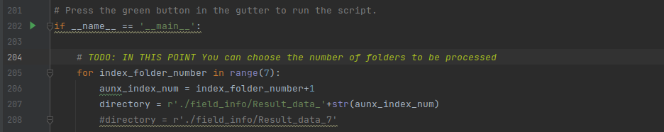

# microgrid2

This is a very short project in which real data were collected from the field. The application was a microgrid running IEC-61850, which is a popular application protocol used on many use cases, such as protection.
The python script was used to post-process the data collected in a real setup. 

The metrics used on this project are an end-to-end performance indicators, at the appication level.

The unique parameter to be changed is the directory path where the dataset is stored.

The last version of it is saved in main_v3.py and the modification on the FOlder can be done in the following line:

